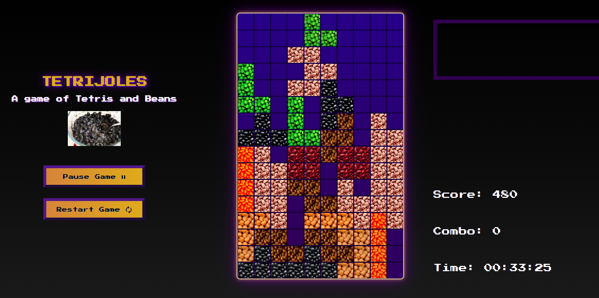

# Tetrijoles

A web-based Tetris implementation with a lot of beans, built using HTML Canvas.

Gameplay inspired by classic Tetris mechanics, with references to the Tetris Wiki and custom adjustments.

It can be played on the browser [here](https://pisakrus.github.io/tetrijoles/).

## Features

- HTML Canvas rendering
- Bean-themed visuals
- Gravity-based piece falling
- Movement buffering (DAS-style controls)
- Rotation system with wall kicks
- Lock delay system
- Ghost piece preview
- Next-piece handling
- Animated incremental score counter
- Combo system
- Sound effects on line clears (fart-based audio with pitch scaling on combos)

## Controls

- Move: Arrow keys / A, D
- Rotate: W / Up Arrow
- Hard drop: Space
- Pause / Restart buttons
